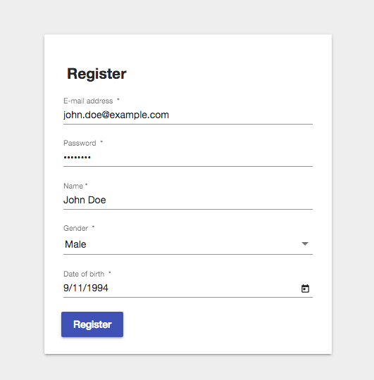

# Healthbook [](https://travis-ci.com/fuvidani/web-app-engineering)  [](https://codecov.io/gh/fuvidani/web-app-engineering)  [](https://ktlint.github.io/)  [](https://opensource.org/licenses/MIT)

Healthbook is a modern web application that allows users to upload their medical information and
to give access to certain research facilities that are interested in the data of target groups. 

## Scenario
The application guarantees confidentiality of uploaded and shared medical information of end users 
by anonymizing them. Research facilities are able to create medical queries targeting different groups of 
patients. Once such a query has been added, users who previously shared certain datasets and now match the
given query are automatically notified. The end user then can decide which (anonymized) dataset gets shared with the 
research facility for which a financial compensation will be received. 

## Features
* Registration & Login (End user)
* Overview of one's own medical datasets and ability to persist new ones (End user)
* Share own medical dataset with specific research facility (End user)
* Login (Research facility)
* Overview of anonymized datasets (Research facility)
* Issue a new medical query (Research facility)

## Technology stack
* [Angular 5](https://angular.io/) with Material Design for the frontend
* [Spring Boot 2](http://projects.spring.io/spring-boot/) for the backend featuring non-blocking 
reactive [WebFlux](https://docs.spring.io/spring/docs/5.0.0.BUILD-SNAPSHOT/spring-framework-reference/html/web-reactive.html#web-reactive) 
REST-API; written in Kotlin
* [MongoDB](https://www.mongodb.com/) for the persistence layer because of its great [reactive support](https://spring.io/blog/2016/11/28/going-reactive-with-spring-data)
* [Docker](https://www.docker.com/) and docker-compose for deployment

## Deployment
Assuming you have working Docker on your machine, simply navigate in your console
to the project root folder (`web-app-engineering`) and start the docker-compose task: 
 ```shell
 docker-compose up
 ```
Note: In order to avoid console output, you may use the ``-d`` (detach) flag.

The following docker images are used:

- **rasakul/waecm-2018-group-09-bsp-2-backend**
    - based on "java:8-jre"
    - hash: sha256:711965b75a5f9af6a0460d6af34c0203c9af4815d138e3683171b0ad09d7cdbd
- **rasakul/waecm-2018-group-09-bsp-2-mongo**
    - based on "mongo:3"
    - hash: sha256:fe947a8e7aadcf97dc84060d7aa0fd33a7009cbaf11094090850cc096b863f2f
- **rasakul/waecm-2018-group-09-bsp-2-frontend**
    - based on "node:9"
    - hash: sha256:82fd452e2084d1ee90e976567ed6fe863a1458614d1b7eea513aadbde070e658
- **swaggerapi/swagger-ui**
    - [Link](https://hub.docker.com/r/swaggerapi/swagger-ui/)
    - hash: sha256:3a96c9da0b2fcb7a813821a0203f4a15cfebaad7d7549763d7840b865fcc9855  

## Usage
After the application has been successfully deployed, the frontend can be accessed under
https://localhost:8069 . Your browser might prompt a warning stating that the connection cannot
be trusted. Simply whitelist the URL and frontend will load. 

**Note 1:** If you get _504 (Gateway Timeout)_ error, you should clear your browser's cache.

**Note 2:** If you are using Chrome, you may get _SecurityError: Failed to register a ServiceWorker_ error, which is
due to the self-signed certificate. To overcome this issue please enable the following option: _chrome://flags/#allow-insecure-localhost_.

There are no end users registered, however you can log in with one
of the following research facility accounts as a research facility:
* **Facility 1**
    * E-mail: `research@who.com`
    * Password: `password`
* **Facility 2**    
    * E-mail: `research@bayer.com`
    * Password: `password`  

#### Home


#### Registration


#### New health data (end user)


#### Share health data (end user)


#### Create medical query (research facility)

## API documentation
The REST API of the backend is fully documented and can be accessed through http://localhost:8888. 
The Swagger UI is hosted in a separate container, which queries the backend's documentation endpoint.

**Important: Once you open Swagger UI it may prompt an error (see image below). This is due to the fact that
the HTTPS certificate of the backend cannot be verified (since it is self-signed). The solution
is to whitelist the https://localhost:8443 URL (address of the backend).**
Solution on Firefox: open Settings -\> Privacy & Security -\> Certificates -\> Show certificates
-\> Server (Tab) -\> Add exception. After whitelisting the backend's address the Swagger UI
should be able to load the API documentation without any problems.


## Security
#### Auth Token
The backend application uses JWT token based authorization to secure the different endpoints. 
Authentication is carried out via basic username (= e-mail) and password input and the backend
replies with a JWT token valid until the next day. The role of the user (end user or research facility)
is encoded into the token so that the backend can also use it for role-based access control.

#### HTTPS
The backend's and the frontend's servers are secured via HTTPS. **Note however, that this is a proof of concept, therefore
self-signed certificates are used.** This is not encouraged in production.

## Development
This section is only for development purposes. In order to start the backend successfully, a local mongo db has to be started and configured appropriately.

The first step is to [install MongoDB](https://docs.mongodb.com/manual/administration/install-community/) on your preferred OS. 
After that, start the database:
 ```shell
 mongod
 ```
 In a separate terminal tab, start the mongo shell:
  ```shell
  mongo
  ```
In the shell, switch to our database:
  ```shell
  use waecmDatabase
  ```
This will create it if it doesn't exist yet and whenever you use ``db`` in the mongo shell this database
will be referenced. Now simply insert the two sample research facility users:
  ```shell
  db.abstract_user.save(
      {
          "_id": ObjectId("5ac9e3e48a6d874b3da4b3f9"),
          "email": "research@who.com",
          "password": "$2a$15$8lEAUlhZagj4Egwt87Vq5ect2LBCwIzwHVFgFTugzKLS/jvebdiGu",
          "_class": "at.ac.tuwien.waecm.ss18.group09.dto.ResearchFacility"
      }
  );
  
  db.abstract_user.save(
      {
          "_id": ObjectId("5ac9e3e48a6d874b3da4b3ff"),
          "email": "research@bayer.com",
          "password": "$2a$15$8lEAUlhZagj4Egwt87Vq5ect2LBCwIzwHVFgFTugzKLS/jvebdiGu",
          "_class": "at.ac.tuwien.waecm.ss18.group09.dto.ResearchFacility"
      }
  );
  ```
The last thing we need to do is add authentication to this database. Just like in production, we want to secure
access to the database by protecting it with a username and password. In order to achieve this, we have to 
create a user with the appropriate role and its credentials:
  ```shell
  db.createUser({ user: 'user', pwd: 'devPassword', roles: [ {role:'readWrite', db:'waecmDatabase'} ]})
  ```
If this succeeded, simply exit the shell (``exit``) and stop the mongo instance. Then restart the mongo
instance, however this time with authorization enabled:
 ```shell
 mongod --auth
 ```
 This will simply turn on authorization.
 
After this, the Spring Boot app should be able to connect to your local mongo db through
`localhost:27017`. 

## Endpoints
Summary of the most important endpoints:
- **Frontend**: https://localhost:8069
- **Backend**: https://localhost:8443
- **Swagger-UI**: http://localhost:8888

## Troubleshooting
Contact one of the contributors or open an issue.

## License
This project is licensed under the [MIT License](https://opensource.org/licenses/MIT). Feel free to
use, extend or fit it to your needs.

